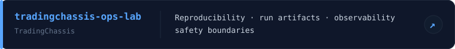
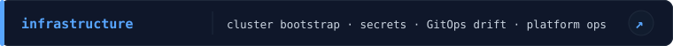
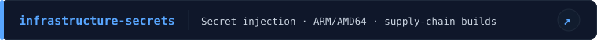
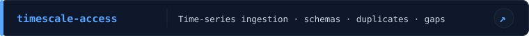
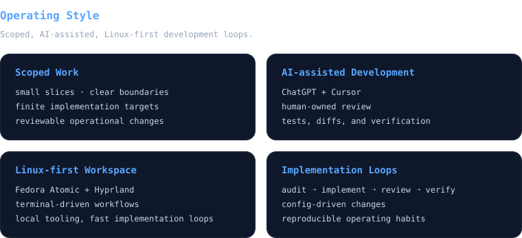

 

In my projects I use trading and market-data infrastructure  
as a realistic testbed for hard reliability and production problems.  

 

 
 

  

  <kbd>
    <strong>Languages</strong>
      
    
  </kbd>
  &nbsp;&nbsp;&nbsp;&nbsp;
  <kbd>
    <strong>Infrastructure</strong>
      
    
  </kbd>

  <kbd>
    <strong>Observability</strong>
      
    
  </kbd>
  &nbsp;&nbsp;&nbsp;&nbsp;
  <kbd>
    <strong>Data / Storage</strong>
      
    
  </kbd>

  <kbd>
    <strong>Delivery / Ops</strong>
      
    
    
    
  </kbd>
  &nbsp;&nbsp;&nbsp;&nbsp;
  <kbd>
    <strong>Workspace</strong>
      
    
    
    
    
  </kbd>

  <kbd>
    <strong>Automation / IaC</strong>
      
    
     
  </kbd>
  &nbsp;&nbsp;&nbsp;&nbsp;
  <kbd>
    <strong>Streaming / Search / Data Systems</strong>
      
    
    
     
  </kbd>

  <kbd>
    <strong>Observability / Runtime Ops</strong>
      
    
    
    
     
  </kbd>
  &nbsp;&nbsp;&nbsp;&nbsp;
  <kbd>
    <strong>Self-hosted Ops Experiments</strong>
      
    
    
     
  </kbd>

