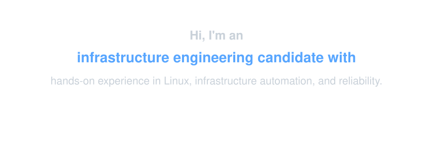

  

### Skills

#### Languages

#### Infrastructure

  

#### Observability

#### Data / Storage

   

#### GitOps / Delivery

    

#### Testing / Documentation

   

#### Workspace

   

### Work

- 🧪 [**TradingChassis Ops Lab**](https://github.com/TradingChassis/tradingchassis-ops-lab) - Local-first operations lab for reproducible run workflows, artifact-backed observability, safety controls, and operational evidence
- ☁️ [**TradingChassis Infrastructure**](https://github.com/TradingChassis/infrastructure) - GitOps-driven Kubernetes YAML IaC on OCI with MicroK8s, Argo CD, Argo Workflows, MLflow, observability, and secrets management
- 🔐 [**TradingChassis Infrastructure Secrets**](https://github.com/TradingChassis/infrastructure-secrets) - Supporting OCI Secrets Store CSI integration with multi-arch image builds for Kubernetes secret delivery
- ⚙️ [**TradingChassis Core**](https://github.com/TradingChassis/core) - Historical deterministic event-driven trading decision engine with shared backtest/live semantics
- 🚦 [**TradingChassis Core Runtime**](https://github.com/TradingChassis/core-runtime) - Historical runtime orchestration layer for reproducible backtesting environments
- 📚 [**TradingChassis Docs**](https://github.com/TradingChassis/docs) - Legacy documentation archive for architecture, ADRs, concepts, operations, and system evolution
- 📈 [**Timescale Access**](https://github.com/bxvtr/timescale-access) - Deterministic Python wrapper for TimescaleDB/PostgreSQL focused on reproducible time-series ingestion and schema utilities
- 📡 [**Deribit History Client**](https://github.com/bxvtr/deribit-history-client) - Python client for historical market data with clean request abstractions and optional API-shape drift detection
- ⏱️ [**Deribit Latency Tester**](https://github.com/bxvtr/deribit-latency-tester) - Rust tool for measuring exchange latency, tick timing, failures, and operation-level response behavior

### Operating Style

- 🎯 **Scoped execution** - Small, reviewable changes with clear boundaries
- 🤖 **AI-assisted, human-reviewed** - ChatGPT and Cursor support the workflow; tests, diffs, and verification stay owned by me
- 🐧 **Linux-first workflows** - Fedora Atomic, Hyprland, terminal-driven tooling, and local feedback loops
- 🔐 **Security-minded operations** - Secret handling, least-privilege defaults, IaC review, and supply-chain awareness

### Learning Roadmap

- 🛡️ **Failure-aware delivery** - Observable automation, safe defaults, rollback paths, and reproducible operating habits
- 🧱 **IaC beyond pure YAML** - Learning Terraform and Ansible to understand repeatable provisioning and configuration management
- 🚚 **CI/CD systems** - Exploring Jenkins to compare pipeline models other than GitHub Actions
- 🌊 **Streaming systems** - Studying Kafka as a foundation for event-driven data and infrastructure workflows
- 🔎 **Operational search** - Building familiarity with Elasticsearch / ELK concepts for logs, search, and incident analysis
- 🧬 **Linux observability** - Exploring eBPF concepts for deeper runtime and system-level visibility

  

