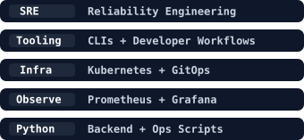
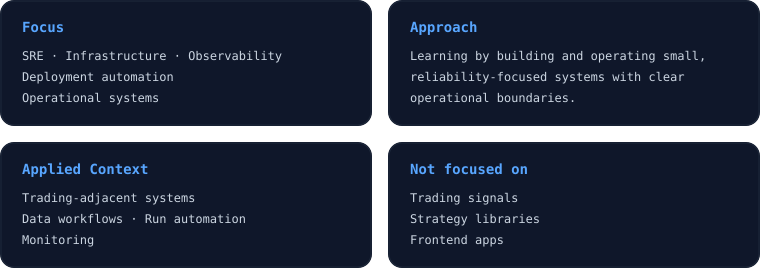
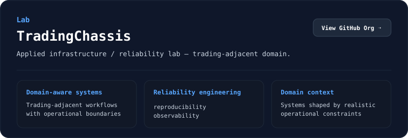

# Hi, I’m

 

<!-- 

 -->

In my projects I use trading and market-data infrastructure as a realistic testbed for hard reliability and production problems. A quick overview:

<!-- | Repository | Hard Problems Addressed |
| --- | --- |
| [`tradingchassis-ops-lab`](https://github.com/TradingChassis/tradingchassis-ops-lab) | Reproducibility, run artifacts, observability, safety boundaries |
| [`infrastructure`](https://github.com/TradingChassis/infrastructure) | Cluster bootstrap, secret delivery, drift control, platform operations |
| [`infrastructure-secrets`](https://github.com/TradingChassis/infrastructure-secrets) | Secure secret injection, ARM/AMD64 compatibility, supply-chain builds |
| [`core`](https://github.com/TradingChassis/core) | Backtest-vs-live drift, deterministic state transitions, risk/execution separation |
| [`core-runtime`](https://github.com/TradingChassis/core-runtime) | Reproducible environments, job orchestration, config-driven runs |
| [`docs`](https://github.com/TradingChassis/docs) | Shared semantics, ADRs, runbook readiness, long-term maintainability |
| [`deribit-latency-tester`](https://github.com/bxvtr/deribit-latency-tester) | Latency measurement, tick-aligned timing, failure behavior, exchange proximity |
| [`deribit-history-client`](https://github.com/bxvtr/deribit-history-client) | API drift, data quality, event time vs. receive time, backtest boundaries |
| [`timescale-access`](https://github.com/bxvtr/timescale-access) | Time-series ingestion, schema management, duplicates, sequence gaps | -->

<!--  -->

<!--  -->

<!-- 

  
  &nbsp;&nbsp;
  

 -->

  

  

  

## Stack

  <kbd>
    <strong>Languages</strong>
      
    
  </kbd>
  &nbsp;&nbsp;&nbsp;&nbsp;
  <kbd>
    <strong>Infrastructure</strong>
      
    
  </kbd>

  <kbd>
    <strong>Observability</strong>
      
    
  </kbd>
  &nbsp;&nbsp;&nbsp;&nbsp;
  <kbd>
    <strong>Data / Storage</strong>
      
    
  </kbd>

  <kbd>
    <strong>Delivery / Ops</strong>
      
    
    
    
  </kbd>
  &nbsp;&nbsp;&nbsp;&nbsp;
  <kbd>
    <strong>Workspace</strong>
      
    
    
    
    
  </kbd>

